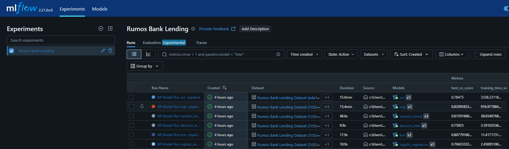
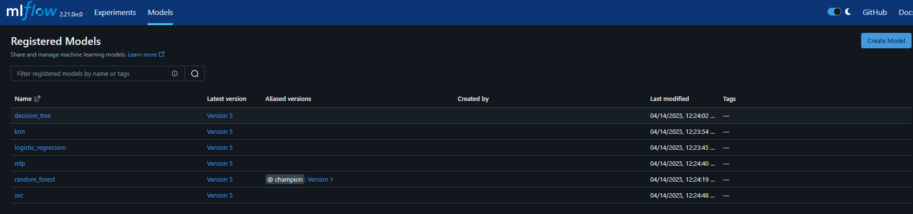
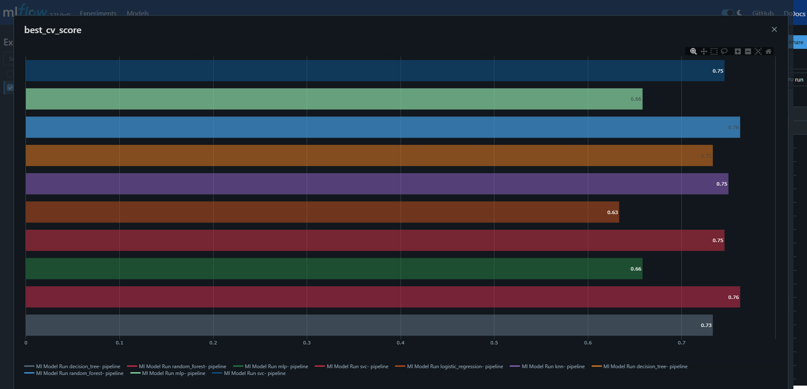
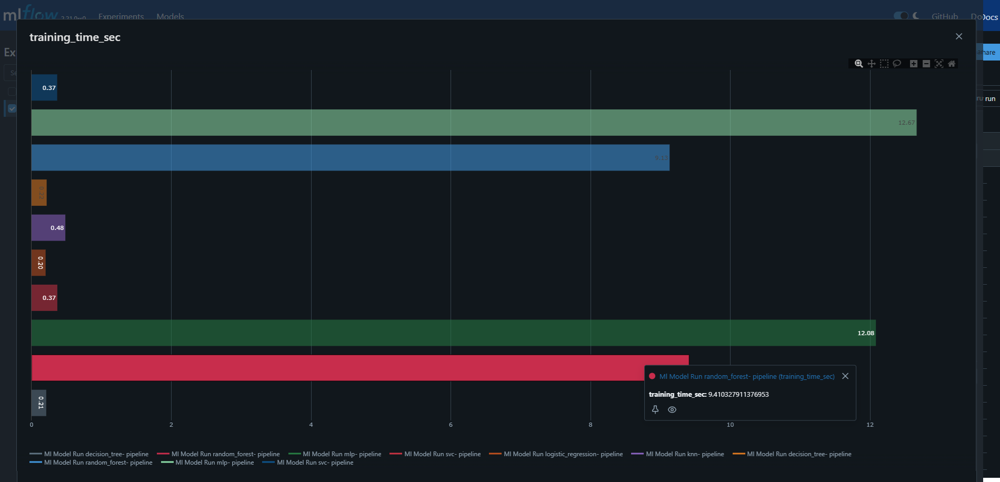
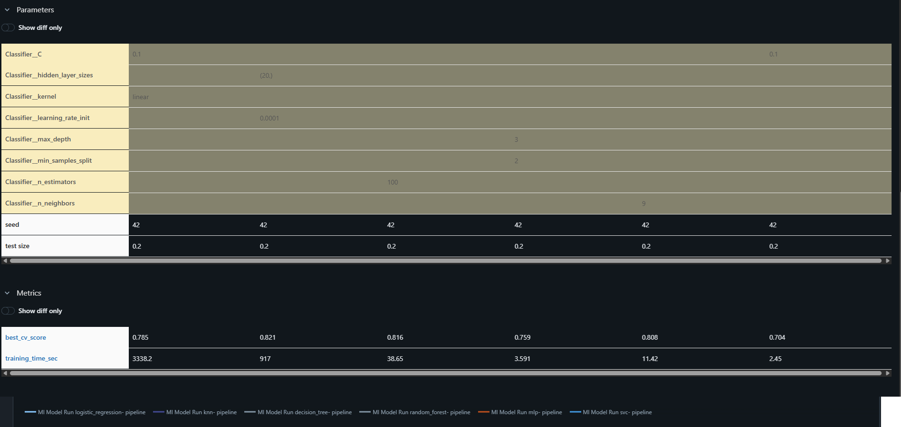

# Documentação do Projeto - Rumos Bank Lending Prediction


## Rumos Bank Going Live
Este projeto responde ao desafio proposto pelo Rumos Bank, que visa desenvolver uma solução de machine learning capaz de prever clientes que poderão falhar no cumprimento dos prazos de pagamento de crédito.

A prioridade do banco é garantir que a transição dos resultados exploratórios para produção é feita de forma eficiente e automatizada, evitando demoras como em experiências anteriores.


> [!IMPORTANT]
> Esta secção contém observações relevantes para garantir a correta execução do projeto.
> A imagem Docker do serviço encontra-se publicada de forma pública no GitHub Container Registry (GHCR).
> 🔗 Imagem: `ghcr.io/pereiranuno/bank_lending_prediction_service:latest`
> O serviço não inclui o modelo diretamente na imagem, pois o mesmo é carregado dinamicamente do **MLflow Tracking Server**, a partir do Model Registry. A versão utilizada é a `champion` do modelo `random_forest`
> Uma instância do MLflow é levantado via `docker-compose` e pode ser acedido localmente em http://localhost:5000
> O ficheiro `conda.yaml` define todas as dependências necessárias para reproduzir o ambiente localmente.
> Pode ser usado com:
 ```bash 
    conda env create -f conda.yaml
    conda activate rumos_bank_lending_
```


## Dependencias
- Python 3.10
- FastAPI
- Scikit-learn
- MLflow
- Conda
- Docker
- Pytest
- uvicorn
- ipykernel
- numpy
- pandas
- pydantic
- cloudpickle
- matplotlib
- requests


## Estrutura Projecto
```plaintext
OML-trabalho/
├── .github/
│   └── workflows/
│       └── cicd.yaml
├── config/
│   └── app.json
├── data/
│   └── lending_data.csv
├── notebooks/
│   └── mlflow/
│       ├── mlflow_model_read.ipynby
│       ├── mlflow_model_reg.ipynby
│   └── rumos_bank_lending_prediction.ipynb
├── src/
│   └── app/
│       ├── main.py
├── tests/
│   ├── test_main.py
│   └── test_model.py
├── conda.yaml
├── docker-compose.yml
├── Dockerfile.Service
└── README.md
```

### Definição Esrutura

- `src/app/main.py` - Código permite expor modelo ML como um serviço utilizando API FastAPI
- `config/app.json` - Configuração do serviço e modelo champion
- `notebooks/rumos_bank_lending_prediction.ipynb` - Notebook exploratório utilizado para otimizar os modelos existentes
- `notebooks/mlflow/mlflow_model_reg.ipynb` - Notebook que regista os modelos e toda e artefactos e experiências no model registry
- `notebooks/mlflow/mlflow_model_read.ipynb` - Notebook que testa a leitura do modelo champion e executa uma predição para um conjunto de inputs aleatórios.
- `conda.yaml` - Ambiente conda com a definição das dependências do projecto
- `Dockerfile.Service` - Dockerfile do serviço do modelo
- `docker-compose.yml` - Orquestração de serviços (MLflow + Modelo como Serviço API)
- `tests/` - Testes unitários da serviço e testes ao  modelo
- `.github/workflows/pipeline.yml` - Pipeline de CI/CD

---


## Reproduzibilidade

Para correr o projeto localmente:

```bash
git clone https://github.com/pereiranuno/OML-trabalho.git
cd OML-trabalho
```
Subir os serviços (MLflow + API)
````docker compose up -d```

Aceder à API: http://localhost:5002/docs
Aceder ao MLflow: http://localhost:5000

Para testar localmente criar o ambiente através
```bash
conda env create -f conda.yaml
conda activate rumos_bank_lending_
pytest
```


## ML Model Registry

Os modelos são treinados e registados com o MLflow, onde a versão com melhor desempenho é promovida para champion.

O serviço consome o modelo diretamente do MLflow Tracking Server, lendo a configuração do modelo em config/app.json a ser utilizado como serviço.

```python
mlflow.set_tracking_uri("http://mlflow-tracking-server:5000")
mlflow.pyfunc.load_model("models:/random_forest@champion")
```

A imagem apresentada mostra a interface do MLflow na aba de das runs feitas para cada modelo. Nesta secção  é possivel  permite visualizar e comparar execuções de treino de diferentes modelos de machine learning realizadas no âmbito deste projeto.

Cada linha representa uma execução (run), ou seja, uma instância em que um modelo foi treinado com um determinado conjunto de parâmetros e dados. A execução é registada com os seguintes detalhes.




A imagem abaixo mostra o separador “Models” da interface do MLflow, onde se encontram registados os modelos resultantes dos treinos realizados no projeto Rumos Bank Lending.

Nesta secção, é possível ver todos os modelos que foram registados no Model Registry, juntamente com a respetiva versão mais recente e informações adicionais.



A imagem apresenta uma visualização comparativa de 6 execuções (runs) de modelos treinados no âmbito do projeto, utilizando a funcionalidade de “Parallel Coordinates Plot” do MLflow. Esta ferramenta permite comparar diferentes execuções com base em métricas selecionadas, facilitando a análise de desempenho.

Cada linha no gráfico representa uma execução, e a sua trajectória liga os valores das duas métricas, training_time_sec: tempo total de treino de cada modelo (em segundos) e best_cv_score: melhor pontuação obtida em validação cruzada em accuracy. 

O modelo MLP (Multilayer Perceptron) obteve o melhor desempenho global, com um best_cv_score de 0.821, e um tempo de treino relativamente elevado: 917 segundos (~15.4 minutos).
O Random Forest surge logo a seguir em termos de performance, com best_cv_score de 0.816, mas com uma grande vantagem no tempo de treino, demorando apenas 38.65 segundos.
Já o modelo SVC (Support Vector Classifier), embora tenha alcançado um score competitivo (0.785), teve um tempo de treino extremamente elevado, de 3338 segundos (~55.8 minutos), o que o torna menos eficiente computacionalmente.
Entre os modelos mais leves, o KNN apresenta uma boa performance (0.808) com apenas 11.42 segundos de treino, o Decision Tree tem best_cv_score de 0.759 e treina em apenas 3.59 segundos e o Logistic Regression foi o mais rápido a treinar (2.45 segundos), mas teve o best_cv_score mais baixo: 0.704.~

O Random Forest é uma excelente escolha em termos de trade-off entre desempenho e eficiência, dai ter sido esolhido como o modelo Champion


O mlflow permite também criar gráficos personalizados para as diferentes métricas. Abaixo são apresentados gráficos para as métricas performance acuraccy, e tempo de execução de cada uma das runs dos modelos. .





A imagem abaixo mostra uma tabela comparativa gerada pelo MLflow, onde são analisadas diferentes execuções de modelos com base nos parâmetros utilizados e nas métricas de desempenho obtidas. Esta visualização é extremamente útil para avaliar o impacto dos hiperparâmetros nos resultados dos modelos. 




## Modelo como um serviço

- O modelo treinado encontra-se exposto através de uma **API REST criada com FastAPI**.
- O endpoint principal de previsão está acessível em: `POST http://localhost:5002/predict_bank_lending`
- A comunicação com a API pode ser feita via Postman ou curl.

#### Exemplo de comunicação:
**Request:**
```http
POST http://localhost:5002/predict_bank_lending
Content-Type: application/json

{
  "LIMIT_BAL": 2000,
  "SEX": 2,
  "EDUCATION": 1,
  "MARRIAGE": 2,
  "AGE": 26,
  "PAY_0": 1,
  "PAY_2": 2,
  "PAY_3": 2,
  "PAY_4": 2,
  "PAY_5": 2,
  "PAY_6": 2,
  "BILL_AMT1": 1001,
  "BILL_AMT2": 1200,
  "BILL_AMT3": 1300,
  "BILL_AMT4": 1249,
  "BILL_AMT5": 1000,
  "BILL_AMT6": 1000,
  "PAY_AMT1": 1000,
  "PAY_AMT2": 1000,
  "PAY_AMT3": 1000,
  "PAY_AMT4": 1000,
  "PAY_AMT5": 1000,
  "PAY_AMT6": 1000
}
```
**Response:**
```http
{
  "prediction": 0
}
```

## CI/CD

O projeto inclui uma pipeline GitHub Actions que:

1. Clona o repositório
2. Constrói os serviços via Docker Compose
3. Cria o ambiente Conda e executa os testes com `pytest`
4. Faz login no GHCR
5. Publica a imagem para o container registry

O acesso à imagem é garantido através do `GITHUB_TOKEN`, pois o repositório está devidamente ligado ao package no GHCR com as respetivas permissões.

---


## Autor
Nuno Pereira
github.com/pereiranuno
pereiranuno@gmail.com


