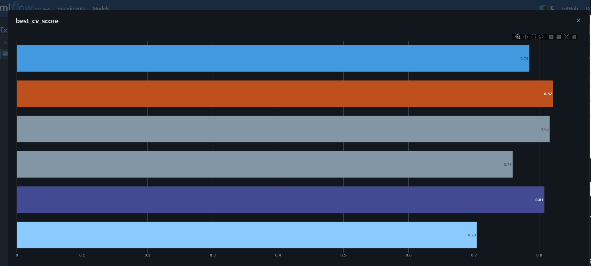

# Avaliação do módulo de Operacionalização de Machine Learning - Projecto Individual

## Rumos Bank going live

The Rumos Bank é um banco que tem perdido bastante dinheiro devido à quantidade de créditos que fornece e que não são pagos dentro do prazo devido. 

Depois do banco te contratar, como data scientist de topo, para ajudares a prever os clientes que não irão cumprir os prazos, os resultados exploratórios iniciais são bastante promissores!

Mas o banco está algo receoso, já que teve uma má experiência anterior com uma equipa de data scientists, em que a transição dos resultados iniciais exploratórios até de facto conseguirem ter algo em produção durou cerca de 6 meses, bem acima da estimativa inicial.

Por causa desta prévia má experiência, o banco desta vez quer ter garantias que a passagem dos resultados iniciais para produção é feita de forma mais eficiente. O objetivo é que a equipa de engenharia consegue colocar o vosso modelo em produção em dias em vez de meses!

> [!TIP]
> Some tips.

> [!IMPORTANT]
> Important notes:

## Installation

## Usage

Instanciar container mlflow
`docker run -p 5000:5000 -v ./mlruns:/mlruns ghcr.io/mlflow/mlflow mlflow ui --port 5000 --host 0.0.0.0 --backend-store-uri ./mlruns --artifacts-destination ./mlruns`

### Dependencies

sdsdwewew